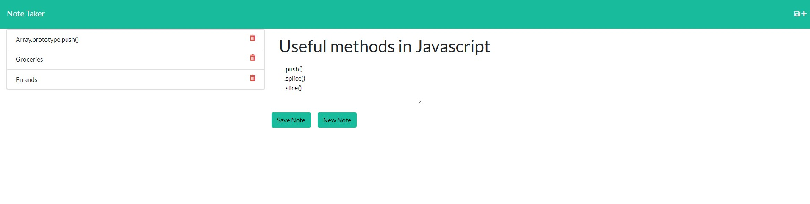

# Note Taker

## Description

Note Taker is an app to help organize different thoughts, comments and other things similar to the note app in many smart phones nowadays.

## Link to Application

## Screenshot

## Usage Information

Create a title for your note with any amount of text. When finished, hit "Create Note" and it will be added to the list to the left. You can click on any note to see its text, and then delete one if you click the trash can next to it.

---

## Questions

[Github](https://github.com/Jeffry_Langford)

[Email](jblangford97@gmail.com)
